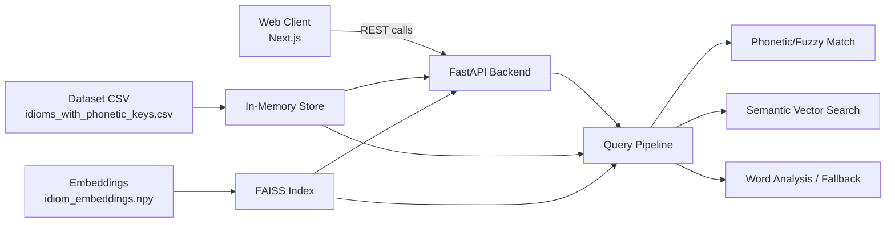
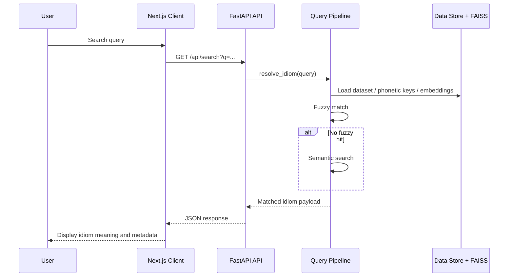

# Konkan Vani Architecture

This document explains the system design of Konkan Vani as a language-search and meaning-resolution platform for Konkani idioms and proverbs. It focuses on architecture and engineering design rather than the visual frontend design.

---

## 1. Overview

Konkan Vani is built as a decoupled, modular system with four major concerns:

1. A web client for user interaction
2. A backend API for query resolution
3. A multilingual idiom dataset and metadata layer
4. A retrieval and matching pipeline that combines lexical, phonetic, and semantic search

The product goal is to accept queries in multiple forms such as Devanagari Konkani, Romanized Konkani, Kannada script, and English/Marathi descriptions, then resolve them to the most relevant idiom and provide meaning, context, and examples.

The architecture is intentionally designed for speed, low operational complexity, and strong search quality without needing a full real-time model server for every request.

---

## 2. High-Level System Architecture



### Core design idea

The system uses a layered pipeline rather than a single monolithic matching algorithm:

- First, it tries fast approximate matching based on phonetic and script normalization.
- Then it falls back to semantic similarity using embeddings and FAISS.
- Finally, it applies conservative word-level analysis and optional fallback logic.

This division reduces latency and keeps the search engine robust across noisy, misspelled, transliterated, and semantically phrased queries.

---

## 3. System Components

### 3.1 Client Layer

Location: `client/`

The client is a Next.js application that presents the idiom search experience and communicates with the backend API.

Responsibilities:

- Accept queries from the user
- Show idiom cards and results
- Support script switching and browsing pages
- Call backend endpoints for search and browse operations
- Gracefully degrade using local fallback data when backend services are unavailable

Design notes:

- It is intentionally thin and stateless from a backend perspective.
- It does not perform NLP logic itself.
- It depends on the backend for lookup quality and semantic resolution.

### 3.2 API Layer

Location: `server-nlp/app/routers/`

The backend uses FastAPI and exposes a small set of routes:

- `/health` for service availability checks
- `/api/search` for searching relevant idioms
- `/api/browse` for listing and filtering idioms
- `/api/resolve` for direct query resolution

Responsibilities:

- Expose HTTP endpoints for the frontend
- Accept and normalize incoming query strings
- Delegate to the matching pipeline
- Return structured result payloads

This API layer is intentionally lightweight. It does not own business logic beyond request validation and orchestration.

### 3.3 Query Resolution Layer

Location: `server-nlp/app/core/query_pipeline.py`

This is the most important design component in the system. It functions as the intelligence layer of the backend.

The resolver pipeline works in stages:

1. Phonetic / fuzzy matching
2. Semantic vector matching
3. Word-level analysis
4. Optional dynamic fallback

This multi-stage design is a practical system architecture choice because real-world user input is noisy and inconsistent. A single exact-match strategy would fail for Romanized spelling errors, small transliteration differences, and semantic paraphrasing.

### 3.4 Data and Index Layer

Location: `data/` and `server-nlp/app/data_loader.py`

The application depends on precomputed, structured assets instead of generating everything at runtime.

Main assets:

- `data/processed/idioms_with_phonetic_keys.csv` — curated idiom dataset
- `data/idiom_embeddings.npy` — embedding vectors for semantic search
- `data/processed/index/konkani.index` — FAISS index for nearest-neighbor similarity
- `data/processed/index/konkani_meta.json` — metadata linked to indexed rows

The data loader reads these resources into an in-memory store used by the matching pipeline.

This is a strong design decision because:

- query latency stays low
- model inference is not repeated per request
- the system separates indexing from serving

### 3.5 Model and Embedding Layer

Location: `server-nlp/app/core/model_registry.py`

The embedding layer uses a shared model instance for encoding queries and comparing them to stored idiom embeddings. This keeps the system efficient and avoids reloading model weights on each request.

Design pattern:

- model is initialized once
- embedded vectors are reused
- similarity search uses FAISS for efficient nearest-neighbor lookup

This is a good example of a classic AI serving pattern: precompute, index, and serve.

---

## 4. Request Flow

A typical search request follows this path:

1. User enters a query in the web UI.
2. Next.js client calls the backend at `/api/search` or `/api/resolve`.
3. FastAPI receives the request and routes it to the query pipeline.
4. The resolver evaluates the query using:
   - phonetic normalization
   - fuzzy string matching
   - semantic vector matching
5. If a result is found with sufficient confidence, a structured idiom response is returned.
6. The client renders the results as cards with meanings, context, and examples.



---

## 5. Data Design

The dataset is built around a structured idiom record model.

Each idiom includes fields such as:

- `konkani_text`
- `romanized_text`
- `script`
- `literal_meaning`
- `figurative_meaning`
- `english_meaning`
- `marathi_meaning`
- `example_sentence`
- `category`
- `cultural_context`
- `phonetic_key`
- `source`

This design enables multiple retrieval modes:

- exact text matching
- approximate matching across scripts
- semantic understanding via embedding similarity
- sorted browsing by category or script

The architecture treats the dataset as a canonical knowledge layer. Search logic sits above it, not inside it.

---

## 6. Why the Architecture Works

### 6.1 Separation of concerns

Each component has a narrow responsibility:

- frontend = interaction
- API = transport and orchestration
- pipeline = retrieval intelligence
- dataset = knowledge base
- index = search acceleration

This keeps the system easier to test, debug, and extend.

### 6.2 Latency-aware design

The system prioritizes fast execution by combining:

- lightweight phonetic matching for direct queries
- precomputed vector indexes for semantic retrieval
- cached model instances for repeated encoding

This avoids the cost of running heavy model operations on every request.

### 6.3 Robustness across input forms

Users may type:

- pure Devanagari text
- Romanized Konkani
- misspelled transliterations
- semantic descriptions

The architecture handles these with multiple retrieval strategies instead of assuming one input style.

### 6.4 Offline resilience

The client includes local placeholder data and fallback behavior. Even when the server is down, the UI can still render a useful response. This is important for developer experience and a basic resilience layer.

---

## 7. Primary Design Patterns

### 7.1 Layered architecture

The system follows a layered approach: client -> API -> business logic -> data/index -> model.

### 7.2 Pipeline pattern

The query resolution flow is implemented as a staged pipeline instead of a single monolithic function.

### 7.3 Precompute-and-serve pattern

Embeddings and indexes are pre-generated and loaded at runtime instead of being computed on demand.

### 7.4 Repository pattern style for access

The data loader centralizes access to CSV and index artifacts, reducing direct file-handling logic across the app.

---

## 8. Storage and Runtime Strategy

The runtime design is intentionally split into:

- generated resources: dataset and model artifacts
- application code: API, data loading, and search logic

This separation keeps the project modular and simplifies re-indexing when the corpus is updated.

The data processing pipeline is handled by scripts in `src/` and `server-nlp/scripts/`, which generate embeddings and indexes from the curated dataset. That means the system supports repeatable, reproducible data updates rather than fragile hand-edited state.

---

## 9. Scalability and Extension Points

The current system is built to scale in a few natural directions:

- Add more idioms and categories to the dataset
- Expand script coverage and transliteration handling
- Add additional ranking or retrieval heuristics
- Introduce caching in front of the API layer
- Replace fallback logic with a more advanced generative service when needed

The most important extension point is the query pipeline. Because search logic is separated into stages, new retrieval methods can be inserted without rewriting the whole stack.

---

## 10. Risks and Trade-offs

### Strengths

- Fast response for common queries
- Good handling of transliteration and spelling variation
- Clear modular boundary between client, API, and search logic
- Strong reuse of precomputed assets

### Trade-offs

- Search quality depends heavily on the quality of the dataset and phonetic normalization
- The distributed architecture introduces operational complexity compared to a single script
- Embedding-based search may still require manual tuning of thresholds
- A pure static knowledge base cannot fully infer novel idioms without a more advanced generation pipeline

---

## 11. Deployment View

The project can be deployed in a simple modern setup:

- frontend: Next.js application on a Node runtime
- backend: FastAPI application on a Python runtime
- model/data assets: static files served from disk or mounted volume
- optional reverse proxy: Nginx or cloud load balancer for production

A minimal production structure could look like:

```text
Client (Next.js)
    |
    v
API Gateway / Reverse Proxy
    |
    v
FastAPI service
    |
    +-- data files + FAISS index
    +-- model registry / embedding encoder
```

This is a clean system design for a domain-specific NLP search platform without introducing unnecessary distributed complexity.

---

## 12. Summary

Konkan Vani is architected as a search-and-resolution system built around four pillars:

- multilingual data modeling
- phonetic and fuzzy retrieval
- semantic vector ranking
- a thin, modular API and client layer

This design is a good fit for a language-sensitive domain problem where user queries vary in script, spelling, and semantics. It balances accuracy, speed, maintainability, and extensibility while keeping the system understandable and operationally manageable.

---

## 13. Relevant Project Areas

- Frontend: `client/`
- Backend: `server-nlp/app/`
- Dataset pipeline: `src/`
- Generated artifacts: `data/`
- API client: `client/lib/api.ts`
- Query logic: `server-nlp/app/core/query_pipeline.py`
